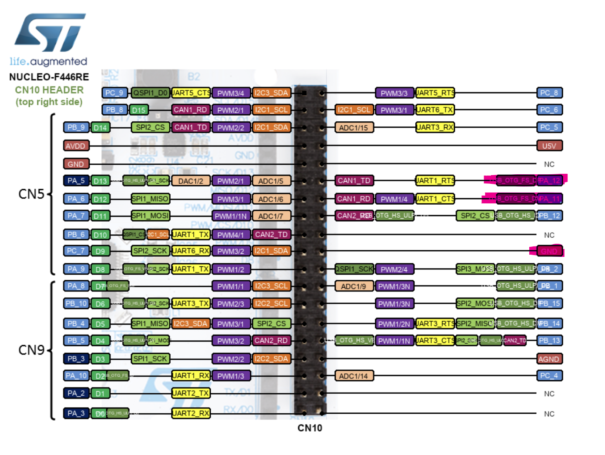

# Mbed6-USB-example
Mbed 6 USB example F446RE   
The program will act as a keyboard print out hello world  
# Pinout 

> **Note**  
> PA12 is D+  
> PA11 is D-  
> GND to USB GND  

# Install
* install Mbed
* have a working F446RE 
* Connect the USB cable

git clone the repo  
```bash
git clone https://github.com/PolyU-Robocon/Mbed6-USB-example.git
```

build and run  